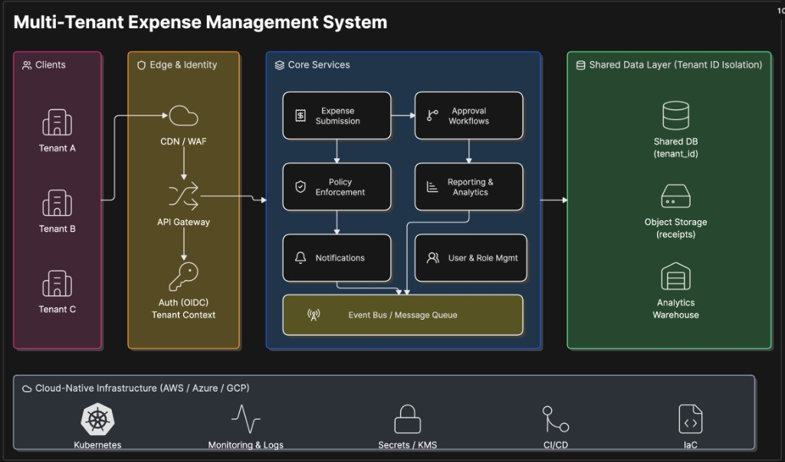

# EMS — Project Overview

A multi-tenant **Expense Management System**: employees raise expenses, a
configurable **multi-level approval workflow** routes them by amount, and
finance/admin get an **observability dashboard** over the whole thing. Built as a
modular monolith with Postgres as the system of record.

This file is the quick map of *what's in the project*. For the full,
screenshot-by-screenshot API + UI reference, see
**[`technical-documentation.pdf`](./technical-documentation.pdf)**.

---

## What's in here

```
project-ems/
  app/                 the application (Node + TypeScript + Express + Postgres)
    src/               source (see "Code layout" below)
    tests/             127 unit + integration tests (run against real Postgres)
    public/            single-page UI (vanilla JS + Chart.js)
    scripts/           UI screenshot + PDF generation helpers
    README.md          how to set up, run, test; API table; caveats
  docs/
    PROJECT-OVERVIEW.md      this file
    README.md                copy of the app README for convenience
    technical-documentation.pdf   full API reference + UI walkthrough (images inline)
  .github/workflows/   CI — type-check + full test suite on every push / PR
```

Design iteration docs (level-1 → level-2.2), the technical-doc markdown source,
the screenshots, and the original brief are archived in
`self-projects/docs/` to keep this folder clean.

---

## What's built (feature list)

- **Multi-tenancy** — every row scoped by `org_id` taken from the auth token; orgs cannot see each other's data.
- **Tenant onboarding** — self-serve signup creates org + first admin + default policy/budget atomically.
- **AuthN/AuthZ** — short-lived JWT access tokens; opaque, hashed, **rotating + revocable refresh tokens** (reuse detection); RBAC (employee/manager/finance/admin) enforced in middleware.
- **Expense lifecycle** — draft → in_review → approved/rejected/withdrawn; two types (reimbursement, company-paid); edit re-evaluates the chain.
- **Configurable approval workflow** — data-driven policy (amount range → ordered approver roles), **versioned and snapshotted at submit** so in-flight expenses are immune to later policy edits. **Stages run sequentially** (the next approver is notified only once the previous level approves; a rejection ends the chain).
- **Single active policy + categories** — exactly one approval policy is active per org (create/activate auto-deactivates the rest, built via a visual rule builder — no JSON); admins manage the org's expense-category list that drives the expense form dropdown.
- **Safe approver routing** — an expense never routes to its own author; if no other eligible approver exists for a level, submission is blocked. Expenses can't be created at all until the org has an active policy.
- **User lifecycle** — admins add and **deactivate/reactivate** users (can't deactivate yourself or the last active admin); inactive users can't log in or be assigned as approvers.
- **Concurrency-safe decisions** — every state transition takes a `SELECT … FOR UPDATE` row lock; idempotency keys dedupe retries.
- **Budgets** — per-user / per-org daily & monthly limits enforced at submit.
- **Multi-currency** — convert to base currency, store the `fx_rate` (static rates).
- **Immutable audit trail** — every change written append-only in the *same transaction* as the change.
- **Notifications** — in-app, generated on workflow events.
- **Observability** — `/metrics` (Prometheus) + analytics dashboard (spend, status, category, SLA, audit volume).
- **Bill uploads** — attach a receipt/invoice (image or PDF) to an expense; bytes are stored through a `BlobStorage` abstraction (local disk now, S3-ready), metadata in Postgres, with authenticated, tenant-scoped download. A mock S3 presign endpoint documents the direct-to-bucket alternative.

---

## Architecture

### Target architecture



The diagram above is the **target / production** architecture: multi-tenant
clients behind an edge + API gateway, stateless core services (expense
submission, approval workflows, policy enforcement, reporting, notifications,
user/role management) communicating over an event bus, on a shared data layer
with `tenant_id` isolation, all on cloud-native infra.

### As-built (prototype)

The current implementation is a **modular monolith** — the same core
capabilities, without the gateway/event-bus/warehouse split:

```
Browser SPA ──HTTP──▶ Express app (modular monolith)
                         │  auth · rbac · expenses · workflow · policy
                         │  budget · audit · notifications · analytics
                         ├──▶ PostgreSQL  (system of record, transactions, row locks)
                         └──▶ Redis (optional cache; in-memory fallback)
```

The app is stateless → horizontally scalable behind a load balancer. The path
from this prototype to the target diagram (service split, event bus, object
storage, analytics warehouse, read replicas / sharding / multi-AZ, durable SLA
timers, OIDC, K8s/IaC) is described in the archived design docs.

## Code layout (`app/src`)

| Path | Responsibility |
|---|---|
| `config.ts` | env-driven config |
| `db/` | pool, `schema.sql`, migrate, seed |
| `storage/` | `BlobStorage` interface + `LocalDiskStorage` (bill bytes; S3-ready) |
| `auth/` | jwt (access), `refreshToken.ts` (rotating refresh), password, middleware |
| `rbac/` | role → permission map |
| `http/` | app factory, errors, async handler, idempotency |
| `metrics/` | in-process metrics + `/metrics` |
| `modules/` | `users` `orgs` `policy` `categories` `budget` `expenses` `workflow` `audit` `notifications` `analytics` `attachments` |

---

## Key design decisions

- **Policy is data, not code** — thresholds/levels change via API, no deploy; snapshotted per expense.
- **Audit ≡ reality** — audit rows are committed in the same transaction as the state change, so they can never diverge.
- **Row lock, not just idempotency** — the `FOR UPDATE` lock serializes concurrent approvals; idempotency keys only handle identical retries.
- **Refresh tokens are opaque + DB-backed** — hashed at rest, single-use rotation, reuse detection; access tokens stay short-lived JWTs.
- **Tenant isolation at app layer today**, with Postgres Row-Level Security documented as the defense-in-depth next step.

## Deliberately deferred (documented, not built)

Real S3 (bill bytes are stored locally today via the `BlobStorage` driver — S3
is a drop-in implementation away), OCR/email, live FX, SLA auto-escalation
scheduler, company-paid tolerance re-approval, sharding/replicas/multi-AZ, RLS
enablement. See the archived design docs and the README caveats for the
production approach.

---

## Run it

```bash
cd app
npm install
cp .env.example .env
createdb ems
npm run setup     # migrate + seed sample data
npm run dev       # http://localhost:4000
npm test          # 127 tests against ems_test (also enforced in CI)
```

Full setup, sample logins, API table and caveats are in
[`README.md`](./README.md).
